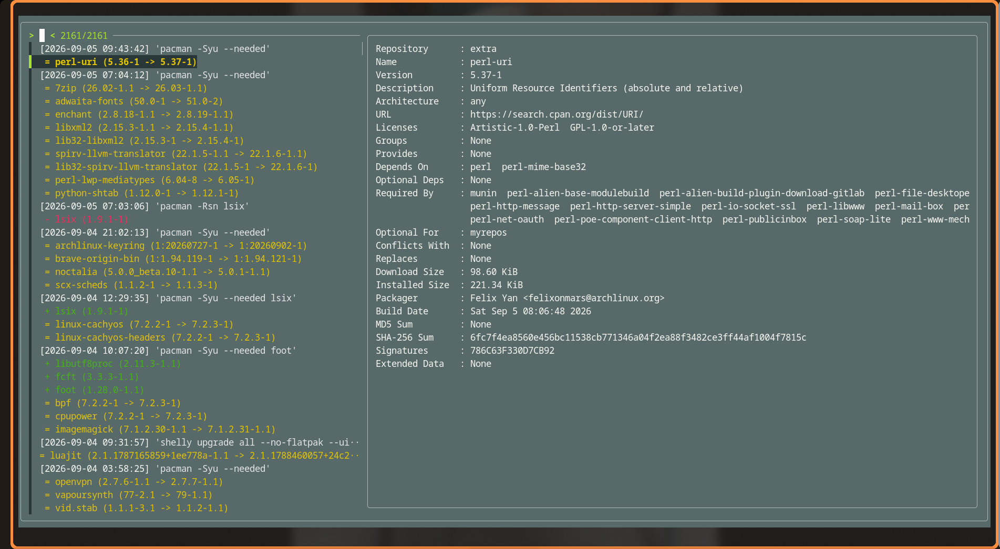

# Package History Navigator

`phn` is a small CLI tool for Arch Linux that organizes package operation history and lets you browse it interactively. It combines entries from `/var/log/pacman.log` and `/var/log/shelly.log`, shows installations, removals, and upgrades, and displays package details from `pacman -Sii` when a package is selected.



## Requirements

- Arch Linux with `pacman`
- Bash
- `awk`, `sed`, `perl`
- [`fzf`](https://github.com/junegunn/fzf) for interactive selection
- `wl-clipboard` (`wl-copy`) for copying the selected command
- optionally, `shelly` if the history should also include operations recorded by Shelly

The script needs access to the relevant log files. If access to `/var/log` is restricted, run it with permissions that allow the logs to be read.

## Installation

```bash
git clone https://github.com/mtriam/package-history-navigator.git
cd package-history-navigator
install -Dm755 phn ~/.local/bin/phn
```

Make sure `~/.local/bin` is included in your `PATH`.

Alternatively, install the script directly with `wget`:

```bash
mkdir -p ~/.local/bin
wget -O ~/.local/bin/phn https://raw.githubusercontent.com/mtriam/package-history-navigator/main/phn
chmod +x ~/.local/bin/phn
```

## Usage

Running the command without arguments opens an interactive view of all operations:

```bash
phn
```

In interactive mode, select an entry in `fzf`. The preview panel on the right shows package information, and the selected command is copied to the Wayland clipboard.

### Modes

| Command | Description |
| --- | --- |
| `phn` | All operations in interactive mode |
| `phn c` / `phn change` | Changes only: installations and removals |
| `phn u` / `phn update` | Upgrades only |
| `phn d` / `phn dump` | Raw data dump instead of the interactive view |

### Modifiers

Modifiers can be combined, for example `phn unm`:

| Modifier | Description |
| --- | --- |
| `n` / `number` | Add line numbers |
| `m` / `monochrome` | Disable colors |

Examples:

```bash
phn c       # installations and removals
phn change  # same as phn c
phn un      # upgrades with line numbers
phn update  # same as phn u
phn du      # upgrades as a raw data dump
phn dump update # raw upgrades dump
phn unm     # upgrades, line numbers, no colors
phn update number monochrome # full modifier names
phn --help
phn --version
```

## How It Works

1. Reads relevant entries from the `pacman` and `shelly` logs.
2. Normalizes dates, operation types, and version numbers.
3. Sorts events chronologically and groups them by the command that was run.
4. Displays the history in `fzf` in interactive mode, while the preview retrieves package information with `pacman -Sii`.

## License

The project is available under the terms described in [LICENSE](LICENSE).